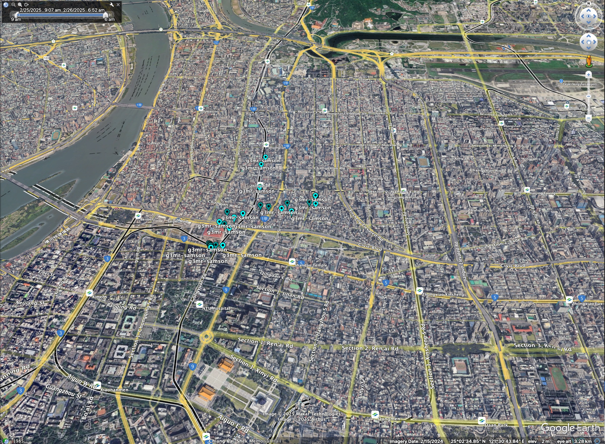

# Daily Post-Processed Data

Non-RTLS data types are also converted to CSV format.

## File Location

| Type         | Usage                      | File Location                                                                                                                                 |
| :----------- | -------------------------- | :-------------------------------------------------------------------------------------------------------------------------------------------- |
| location     | GPS Location Information   | exported_data_v2/{collector}/{family_account}/post-processed/location/{MAC}/{YYYYMM}/{YYYY}-{MM}-{DD}_{MAC}_{device_name}_location.csv.gz     |
| location-kml | GPS Location in KML format | exported_data_v2/{collector}/{family_account}/post-processed/location/{MAC}/{YYYYMM}/kml/{YYYY}-{MM}-{DD}_{MAC}_{device_name}_location.csv.gz |
| pedo         | Watch Pedometer Readings   | exported_data_v2/{collector}/{family_account}/post-processed/pedo/{MAC}/{YYYYMM}/{YYYY}-{MM}-{DD}_{MAC}_{device_name}_pedo.csv.gz             |
| motion       | Motion Sensor Reports      | exported_data_v2/{collector}/{family_account}/post-processed/motion/{MAC}/{YYYYMM}/{YYYY}-{MM}-{DD}_{MAC}_{device_name}_motion.csv.gz         |

## Location Report

If the GPS feature is enabled, the coordinates information are stored. Refer to [Location GPS](./daily-source-data.md#location-gps) for more information.

| field            | description                                           |
| :--------------- | :---------------------------------------------------- |
| family_id        | The family account email this watch was registered on |
| device_name      | the name of the watch on CA Insight                   |
| device_mac       | the MAC address of the watch                          |
| scanned_at_ms    | Time that this pedo-beacon packet was scanned         |
| scanned_at_utc   | Human format of scanned_at_ms                         |
| gps_latitude     | GPS latitude                                          |
| gps_longitude    | GPS longitude                                         |
| gps_accuracy     | GPS accuracy reported from the mobile                 |
| reason_code      | Reason Code reference in the location_log database    |
| phone_name       | Name of the phone that reported this GPS record       |
| sender_device_id | mobile unique-id for the database reference           |

### KML Location Data

When the location data is generated, its KML format is also generated. KML is a standard format to be used for map viewing. The time zone in the latest g3mr watch setting is used for the conversion, even if the time zone was changed during that day. You can use [Google Earth](https://earth.google.com/web/) or [Google Earth Pro](https://www.google.com/earth/about/versions/) to view the KML file. If you want to concatenate multiple location files, you can use [loc2kml tool](../tools/loc2kml/README.md).

## Pedometer Report

Care Active watch tracks the steps (pedometer) while sending the RTLS report. Pedometer broadcasting happens once every 53 minutes. If any of the stations receive this pedometer broadcasting, it will be logged in the pedometer report.

| field          | description                                                                                                                             |
| :------------- | :-------------------------------------------------------------------------------------------------------------------------------------- |
| family_id      | The family account email this watch was registered on.                                                                                  |
| device_name    | the name of the watch on CA Insight                                                                                                     |
| device_mac     | the MAC address of the watch                                                                                                            |
| scanned_at_ms  | Time that this pedometer packet was scanned                                                                                             |
| scanned_at_utc | Human format of scanned_at_ms                                                                                                           |
| t_mark_day     | Days since January 1st on the watch. This could be wrong if the time of the watch needs to be adjusted.                                 |
| t_mark_rnd     | A random number from the watch. This random number is updated per power-cycle. This helps to tell whether there is a power cycle or not |
| pedo_d0        | The step count of the current day                                                                                                       |
| pedo_d-1       | The step count of yesterday                                                                                                             |
| pedo_d-2       | The step count of the day before yesterday                                                                                              |
| sender_id      | The device who sends the steps count(s), this can be a station or a mobile unique ID                                                    |

### Single Step Count and Triple Counts

If the steps count is sent from a mobile, there will be only one current day's steps count. If it is sent by a station, there can be 3 steps counts, D0, D-1 and D-2.

## Motion Report

Motion report is the log of the motion sensor triggered events.

| field          | description                                                                           |
| :------------- | :------------------------------------------------------------------------------------ |
| family_id      | The family_account email this watch was registered on.                                |
| device_name    | the name of the sensor on CA Insight                                                  |
| device_mac     | the MAC address of the sensor                                                         |
| scanned_at_ms  | Time that this motion activity packet was scanned                                     |
| scanned_at_utc | Human format of scanned_at_ms                                                         |
| room_type      | The room_type of the station, refer to [room types](maintenance-reports.md#room-type) |
| battery        | Battery level                                                                         |
| motion_cvl     | Motion level of this activity event                                                   |
| motion_cvl_max | Max motion level of the recent 30 seconds                                             |
| rssi           | station_id                                                                            |
