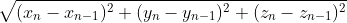
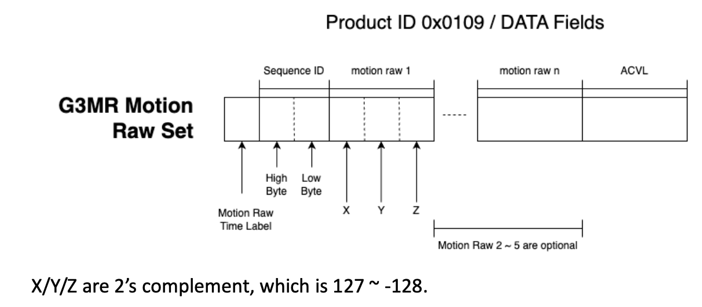

# Daily RTLS-Activity Report

The RTLS data is converted into three different formats. To understand how the RTLS-Activity is generated, please refer to the document ```Care Active Watch Advertising``` in [Document of Processing Tools](README.md#document-of-processing-tools).

## File Location

| Type          | Usage                                       | File Location                                                                                                                                       |
| :------------ | ------------------------------------------- | :-------------------------------------------------------------------------------------------------------------------------------------------------- |
| RSSI          | Indoor Location                             | exported_data_v2/{collector}/{family_account}/post-processed/rtls-rssi/{MAC}/{YYYYMM}/{YYYY}-{MM}-{DD}_{MAC}_{device_name}_rtls_rssi.csv.gz         |
| CVL           | Activity-Location Data                      | exported_data_v2/{collector}/{family_account}/post-processed/rtls-cvl/{MAC}/{YYYYMM}/{YYYY}-{MM}-{DD}_{MAC}_{device_name}_rtls_cvl.csv.gz           |
| Resampled-CVL | Per-second Resampled Activity-Location Data | exported_data_v2/{collector}/{family_account}/post-processed/rtls-cvl/{MAC}/{YYYYMM}/resampled/{YYYY}-{MM}-{DD}_{MAC}_{device_name}_rtls_cvl.csv.gz |
| XYZ           | Original Selected Motion Raw                | exported_data_v2/{collector}/{family_account}/post-processed/rtls-xyz/{MAC}/{YYYYMM}/{YYYY}-{MM}-{DD}_{MAC}_{device_name}_rtls_xyz.csv.gz           |

## RSSI data report

The advertising duration per sampling of a Care Active Watch is 3 seconds, and the advertising interval is less than 3 seconds. This means it is possible that a station may receive the same motion packet more than once. This RSSI data report lists every single receiving event from all stations that received the motion packet.

File name: `{date}_{MAC}_{device_name}_rtls_rssi.csv`

| Field             | Note                                                                                                                      |
| :---------------- | :------------------------------------------------------------------------------------------------------------------------ |
| created_at_ms     | The time when the cloud receives this packet                                                                              |
| family_id         | The family account email this watch was registered on                                                                     |
| device_name       | The name of the watch on CA Insight                                                                                       |
| device_mac        | The MAC address of the watch                                                                                              |
| event_seq         | The Sequence ID from the motion raw broadcasted from the watch                                                            |
| time_label        | Time label of the selected motion raw, refer to [Care Active Watch Advertising](./README.md#document-of-processing-tools) |
| motion_data_total | Total selected motion raws received                                                                                       |
| station_name      | The name of the station that received this packet                                                                         |
| station_id        | The serial number of the station                                                                                          |
| room_type         | The room_type of the station, refer to [room types](maintenance-reports.md#room-type)                                     |
| rssi              | The rssi value that station received this packet                                                                          |
| scanned_at_ms     | The scan at time when the station received this packet                                                                    |

## CVL data report

CVL Report is calculated based on the daily raw RTLS data for the Activity/Indoor Location Graph generation and analysis. For more information about CVL and ACVL, please refer to [Care Active Watch Advertising](./README.md#document-of-processing-tools).

File name: `{date}_{MAC}_{device_name}_rtls_cvl.csv`

### CVL

CVL (Cumulated Vector Length) is used to measure the motion intensity. CVL is the sum of vector length (norm) in a 3-second sampling collection. To compensate for possible packet loss, CVL values are continuously accumulated into the A-CVL (Accumulated CVL) until the 3-byte integer overflows.



| Field                          | Note                                                                                                              |
| :----------------------------- | :---------------------------------------------------------------------------------------------------------------- |
| family_id                      | The family_account email this watch was registered on                                                             |
| device_name                    | The name of the watch on CA Insight                                                                               |
| device_mac                     | The MAC address of the watch                                                                                      |
| sample_at_ms                   | Refer to [Sample At Time Estimation](#sample-at-time-estimation)                                                  |
| sample_at_utc                  | Refer to [Sample At Time Estimation](#sample-at-time-estimation)                                                  |
| sample_at_source               | Refer to [Sample At Time Estimation](#sample-at-time-estimation)                                                  |
| sample_at_station              | Refer to [Sample At Time Estimation](#sample-at-time-estimation)                                                  |
| event_seq                      | The Sequence ID from the motion raw broadcasted from the watch                                                    |
| seq_diff                       | The sequence ID difference with the previous received motion raw data. It could be large if this is the first row |
| acvl                           | Accumulated CVL                                                                                                   |
| cvl_increment                  | Increment since the previous received acvl value. If -1, it is the first row                                      |
| xyz_count                      | Total selected motion raw vector sets were received in this sampling                                              |
| ref_station_id                 | The "station_id" of the first station seen by the cloud that received this packet                                 |
| ref_scanned_at_ms              | The time when this packet was received by "ref_station_id"                                                        |
| {room_type}_{station_MAC}_rssi | The RSSI value when this packet was received by this station                                                      |

### Reference Station

The reference station was selected from all the stations that received the same motion packet. The first one seen by the cloud was picked, which has the lowest value of "created_at_ms" from the RSSI data report among the stations that received the same motion packet (same motion Sequence ID "event_seq"). The reference station is used to establish the connections between the CVL data report and the RSSI data report. "ref_scanned_at_ms" is a reference time in the CVL data report, which means it is only the received time from one of the received stations if there were multiple stations that received the same packet.

### Sample At Time Estimation

Time is a difficult subject in rtls reports. When a station receives a packet sent from the watch, the station will log the time and send the information to the cloud. The logged time is the real-time-clock running in the station. If there is only one station in the environment, it is not a problem. But if there are multiple stations receiving the same packet, it will be a problem. It is no guarantee that every single station's clock is perfectly synchronized. In fact, most cases are not. When the cloud attempts to sequence the received activity/location data, there might be some time conflicts. Sample_at time is the time sequence that the cloud tries to resolve as the best estimated time-sequence that has no time-order conflicts.

| Field             | Note                                                 |
| :---------------- | :--------------------------------------------------- |
| sample_at_ms      | Assessed time based on the station-logged-time       |
| sample_at_utc     | UTC time of sample_at_ms                             |
| sample_at_source  | Method that the cloud used to determine sample_at_ms |
| sample_at_station | Alternative station-logged-time used                 |

#### Sample_at Source

| sample_at_source | How did the cloud get sample_at_ms                                                                                                     |
| :--------------- | :------------------------------------------------------------------------------------------------------------------------------------- |
| 1                | No conflict, value comes from ref_scanned_at_ms                                                                                        |
| 2                | Use scanned_at_ms from another station, station ID is indicated in sample_at_station                                                   |
| 3                | There is a conflict, and no alternative station time can be used. Use a calculated time based on the previous and the next packet time |
| 4                | Duplicate event_seq found, the watch may experience a power cycle                                                                      |
| 5                | This is not supposed to happen, internal assessment algorithm error                                                                    |
| 0                | This is not supposed to happen, internal assessment algorithm error                                                                    |

### Resampled-CVL

When the CVL-Location data is processed in the cloud. The cloud also resamples RSSI and ACVL time-series data into 1-second intervals using linear interpolation. It ensures full 24-hour coverage by creating empty records for gaps between resampling sections. The tool runs in the cloud is the same tool in this repository. For more information, refer to [cvl-resampling](../tools/cvl-resampling/README.md).

## XYZ Data Report

XYZ report lists all the selected motion raw information.

File name: `{date}_{MAC}_{device_name}_rtls_xyz.csv`

| Field             | Note                                                                                                                      |
| :---------------- | :------------------------------------------------------------------------------------------------------------------------ |
| family_id         | The family account email this watch was registered on                                                                     |
| device_name       | The name of the watch on CA Insight                                                                                       |
| device_mac        | The MAC address of the watch                                                                                              |
| sample_at_ms      | Refer to [Sample At Time Estimation](#sample-at-time-estimation)                                                          |
| sample_at_utc     | Refer to [Sample At Time Estimation](#sample-at-time-estimation)                                                          |
| sample_at_source  | Refer to [Sample At Time Estimation](#sample-at-time-estimation)                                                          |
| sample_at_station | Refer to [Sample At Time Estimation](#sample-at-time-estimation)                                                          |
| event_seq         | The Sequence ID from the motion raw broadcasted from the watch                                                            |
| acvl              | Accumulated CVL                                                                                                           |
| xyz_count         | Total selected motion raw vector sets were received in this sampling                                                      |
| ref_station_id    | The "station_id" of the first station seen by the cloud that received this packet                                         |
| ref_scanned_at_ms | The time when this packet was received by "ref_station_id"                                                                |
| time_label        | Time label of the selected motion raw, refer to [Care Active Watch Advertising](./README.md#document-of-processing-tools) |
| x/y/z             | Selected Motion Raw data sets (1-5)                                                                                       |



## Revision History

| Document Revision | Revision Date | Description                                                                                       | Note        |
| :---------------: | :-----------: | ------------------------------------------------------------------------------------------------- | ----------- |
|        0.1        |  2023-08-03   | initial version                                                                                   | first draft |
|        0.2        |  2023-09-25   | separate the maintenance reports and post-process data                                            |             |
|        1.0        |  2023-10-12   | add the storage path of the file                                                                  |             |
|        1.1        |  2023-11-01   | add the family_id and device_name                                                                |             |
|        1.2        |  2023-12-07   | change to use sample_at_ms and add room_type to the field                                         |             |
|        1.3        |  2023-12-13   | add seq_diff and cvl_selected                                                                     |             |
|        1.4        |  2024-06-26   | new rtls rssi report                                                                              |             |
|        1.5        |  2024-08-05   | Remove sample_at_ms from rtls-rssi and rtls-cvl reports, add ref_station_id and ref_scanned_at_ms |             |
|        2.0        |  2025-03-11   | Revised based on the data format version 2                                                        |             |
