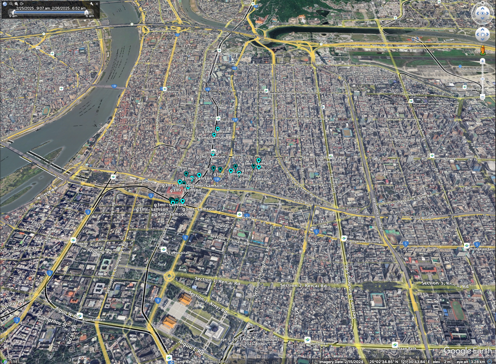

# Care Active Collector of Location CSV to KML Conversion Tool

Convert location data to KML files. KML is a standard format used for map visualization. Usually, you don't need to use this tool as daily KML files are automatically generated when location data is processed in the cloud. This tool is primarily useful when you want to view data with different timezone settings by regenerating KML files from the original location CSV files.

## Usage

```script
  csv2kml [options] [csv_files...]

Options:
  -dir string
    	Directory containing CSV files
  -output string
    	Output KML file path
  -path
    	Generate connected paths instead of individual placemarks
  -timezone string
    	Timezone for conversion (TZ Database Identifier) (default "UTC")

Examples:
  Process all CSVs in a directory:
    ./loc2kml -dir=/path/to/csv/files -output=result.kml -timezone=America/Toronto

  Process specific CSV files:
    ./loc2kml -output=result.kml -timezone=UTC data1.csv data2.csv
  Create path instead of individual points:
    ./loc2kml -path -output=path.kml data1.csv
```

## Timezone

The location code of timezone is defined by IANA. Refer to the IANA tz database for the available options.

[List of tz database](https://en.wikipedia.org/wiki/List_of_tz_database_time_zones)

## Path

The `-path` option generates a KML file with connected paths instead of individual placemarks. This is useful for visualizing the route taken by the device. If there is only one location in the CSV file, the path will be generated as a single point.

## How to View a KML file

You can use [Google Earth](https://earth.google.com/web/) or [Google Earth Pro](https://www.google.com/earth/about/versions/) to view the KML file.


